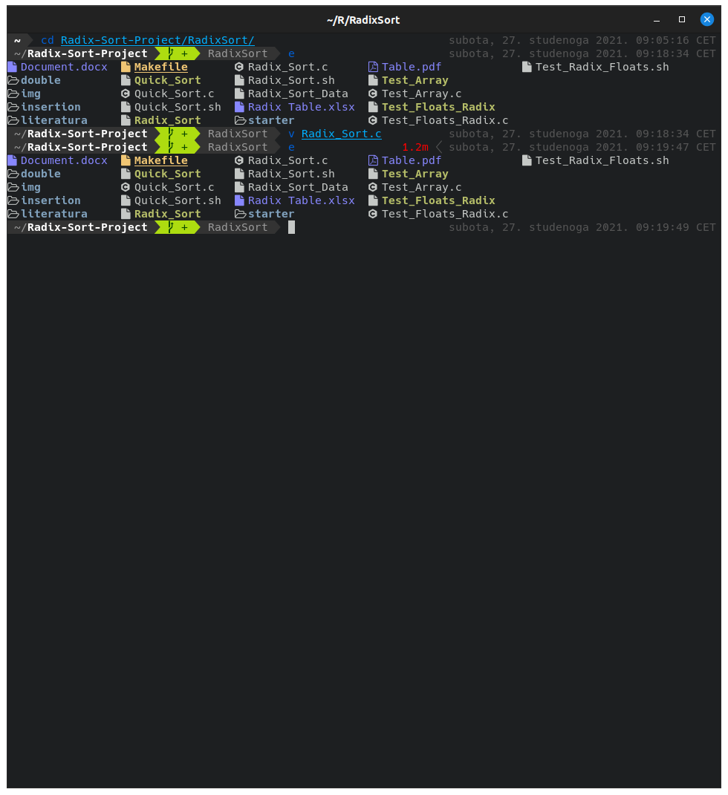
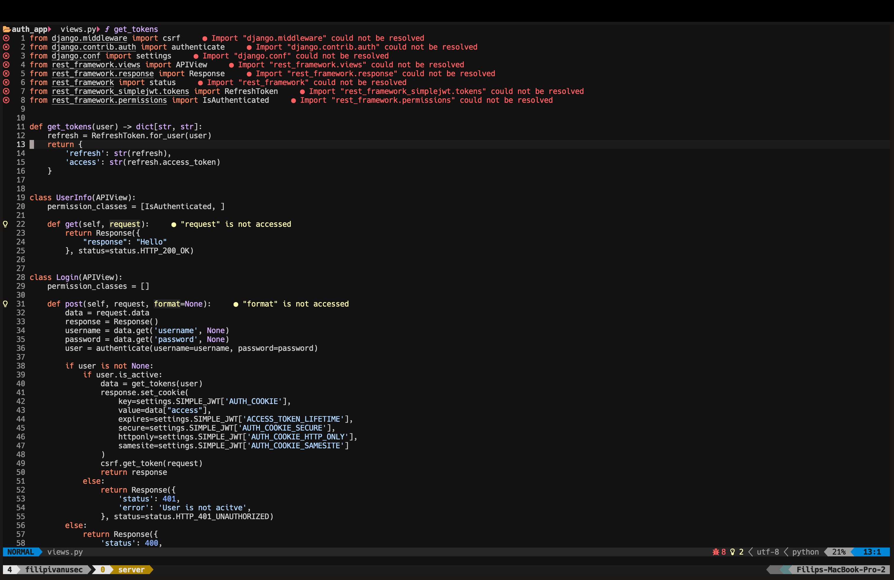

# My dotfiles

Here are the dotfiles that I use on all of my setups. Doesn't matter which distribution you use, it should work right out of the box. Just make sure you have all programs on the given list.
Since I got my job I have been using macos and this configuration suits both macos and linux aswell.

My tmux config should be able to wrok out of the box if you have installed Nerd fonts(in my case I use Hack Nerd font).
I am keeping my old tmux powerline and status line config for safe keeping since they are also very okay to use.

Programs that I use for this to work:

1. [alacritty](https://github.com/alacritty/alacritty) -> Terminal emulator.
2. [tmux](https://github.com/tmux/tmux) -> Terminal multiplexer.
3. [fish-shell](https://fishshell.com/) -> If you want this to work out of the box you will need fish shell.
4. [fisher](https://github.com/jorgebucaran/fisher) -> Using it to install theme which is [Tide](https://github.com/IlanCosman/tide) and to install extensions like nvm.
5. [git](https://git-scm.com/) -> It comes in almost every Linux distribution, but if you don't have it just install it from your package manager.
6. [exa](https://github.com/ogham/exa) -> Much better alternative to ls, just make sure you install icons and it will look much cleaner.
7. tree -> When I'm working on a project I use this command to structure my files.
8. [neovim](https://neovim.io/) -> Editor
9. [Nerd fonts](https://github.com/ryanoasis/nerd-fonts) -> Font I use is Hack from Nerd fonts. <b>Hack nerd font</b>

# Instalation

To use my dotfiles you will need to copy all of the dotfiles into .config, as folder structure suggests.

# Neovim installation

Since vim script become such a pain in the ass to maintain, neovim embeded lua and the whole thing become such a delight to configure.
I based my config of [CarftzDog](https://github.com/craftzdog/dotfiles-public)s config so it is similar to his as I find his and mine needs similar and his config just works out of the box.

Out of the box you get support for:

- Typescript
- Javascript
- Python
- TailwindCSS
- Astro
- Lua

I use github-theme, but If you don't like that specific theme you create separate file where your theme config is in `after/` folder.

# Issues

This has been tested and proven working on my machines but issues can happen and if you come across one feel free to open it here. Have fun using it :smile:
