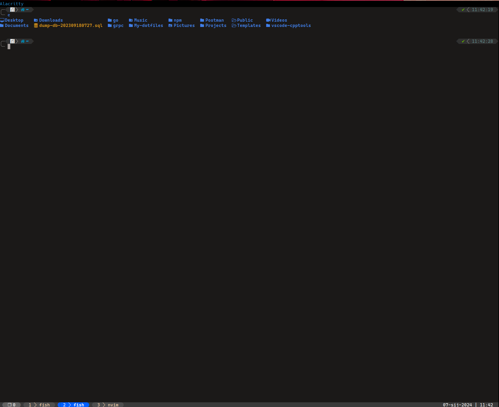
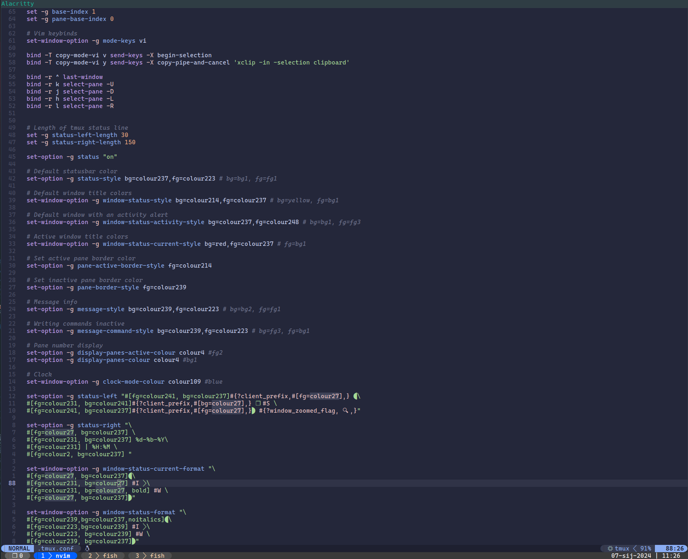

# My dotfiles

Here are the dotfiles that I use on all of my setups. Doesn't matter which distribution you use, it should work right out of the box. Just make sure you have all programs on the given list.
Since I got my job I have been using macos and this configuration suits both macos and linux aswell.

My tmux config should be able to wrok out of the box if you have installed Nerd fonts(in my case I use Hack Nerd font).
I am keeping my old tmux powerline and status line config for safe keeping since they are also very okay to use.

Programs that I use for this to work:

1. [alacritty](https://github.com/alacritty/alacritty) -> Terminal emulator.
2. [tmux](https://github.com/tmux/tmux) -> Terminal multiplexer.
3. [fish-shell](https://fishshell.com/) -> If you want this to work out of the box you will need fish shell.
4. [fisher](https://github.com/jorgebucaran/fisher) -> Using it to install theme which is [Tide](https://github.com/IlanCosman/tide) and to install extensions like nvm.
5. [git](https://git-scm.com/) -> It comes in almost every Linux distribution, but if you don't have it just install it from your package manager.
6. [exa](https://github.com/ogham/exa) -> Much better alternative to ls, just make sure you install icons and it will look much cleaner.
7. tree -> When I'm working on a project I use this command to structure my files.
8. [neovim](https://neovim.io/) -> Editor
9. [Nerd fonts](https://github.com/ryanoasis/nerd-fonts) -> Font I use is Hack from Nerd fonts. <b>Hack nerd font</b>
10. [LazyVim](https://www.lazyvim.org/) -> Neovim distro I use now

# Instalation

To use my dotfiles you will need to copy all of the dotfiles into .config, as folder structure suggests.

# Neovim installation

Since vim script become such a pain in the ass to maintain, neovim embeded lua and the whole thing become such a delight to configure.
Since 2023-11-10 I adopted LazyNvim distro which in most part for now fullfills my need for editor. I am not 100% set on config that I use but currently this fullfills all my needs.
You can reference docs [here](https://www.lazyvim.org/)

With lazyvim you get some themes installed on system. For now I settled for tokyo-night from same author of LazyVim. 

# <b>NOTICE</b>

This setup is run on all my machines:
- I have a mac for my day job and this setup works out of the box(M1 Macbook pro with 16GB of RAM and 256GB of memory)
- I have linux setup with Manjaro KDE and i3WM as my main workbench(Lenovo ThinkPad T490 with 24GB of RAM and 512GB of memory)

My go to(now) for linux is:

- Manjaro(KDE)
- i3WM

I don't use this setup on windows nor will anytime soon.
I also use this setup to program both professionaly and as hobby so yes, you can use it in professional use.

# Issues

This has been tested and proven working on my machines but issues can happen and if you come across one feel free to open it here. Have fun using it :smile:
